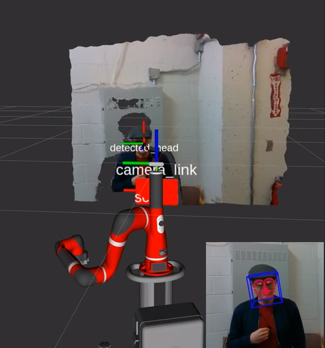

# OpenFace ROS package

Repository that hosts software libraries and ROS packages for gaze and emotion detection, performed at the Human Interaction and Robotics Lab in University of Colorado at Boulder.



The software in this repo has been developed for, and tested on, a Sawyer Research Robot and Realsense---a widely used platform for research in HRC. Nonetheless, it is easy to customize to any robotic platform that shares similar hardware features. In fact, this package can be used with just a standalone Intel Realsense camera (with one change to our code, that we'll detail later)!

## Installation

Guide for installing, compiling and testing the `openface_ros` package in your ROS environment. This tutorial should be useful regardless of your skill level, from a first-time ROS user to an experienced robotics engineer.

### Prerequisites

#### System Dependencies

This repository needs `openface` and `realsense`. To install, compile and test openface package, please refer to the [installation tutorial](https://github.com/TadasBaltrusaitis/OpenFace/wiki) in openface github wiki page. Also, for the realsense package, please refer to the [installation tutorial](https://github.com/IntelRealSense/realsense-ros) in the realsense github page.

#### ROS Dependencies

This repository supports `ROS kinetic` and `ROS melodic` (recommended). It currently hasn't been tested on `ROS noetic` (yet). For installation, checkout [here](http://wiki.ros.org/melodic/Installation) for installing `ROS melodic`.

##### Catkin Tools

We use the new Catkin Command Line Tools `catkin_tools`, a Python package that provides command line tools for working with the catkin meta build system and catkin workspaces. The following instructions apply to this new package, even though the repository can be used and compile with the old `catkin_make` without issues.

```sh
sudo apt install python-catkin-tools
```


### Execution with just the camera.

This package works for just using the Realsense camera. To do so, go to `launch/openface_ros.launch`, and comment (or delete) this line - line 4:

```xml
<node name="send_urdf_fragment" pkg="intera_interface" type="send_urdf_fragment.py" output="screen" args="-f $(find openface_ros)/urdf/realsense.urdf -l head -j camera_link_base" />
``` 

From here, go to the `How to run this package` section to run the launch file, and then run the node where Openface actually runs.

### Execution on the robot

#### Initial steps 

 1. Turn on the robot. Wait for the robot to finish its start-up phase.
 2. Be sure that the system you're running the code has access to the Sawyer robot. This is usually done by running the `intera.sh` script that should be provided in your Sawyer installation. See [here](http://sdk.rethinkrobotics.com/intera/SDK_Shell) for more info.
 3. Connect Realsense camera with USB 3.0 port in your computer.

#### How to run this package

After cloning and building this repo, you need to launch the enviroment we need, which include realsence and sending a new urdf into Sawyer robot. Then, you can run the sample code called `openface_realsense` in this package. To run things above, you can run the commands below.

```sh
roslaunch openface_ros openface_ros.launch
rosrun openface_ros openface_realsense
```

In `openface_realsense`, we first initialize an OpenFaceRos object, and it will detect human's gaze and emotion and also pop out a screen with pose, gaze firection on user's face.

## Functions of OpenFaceRos

Most of the core functions are implemented in `openface_ros.cpp`. Belows are details of some important functions in OpenFaceRos.

* `OpenFaceRos constructor`: For constructor, we need focal length, center of realsense, threshold of distance betwenn gaze vector and target and a flag enable action unit or not.

* `getNose, getLeftPupil, getRightPupil`: These three functions will give you position of nose, left pupil and right pupil individually. The location is pixel-based, which means the location in the showing image.

## More information

Here we'll include more information in this package.

### Meshes

This folder is for CAD files that we can show different objects (realsense) in simulators like rviz and gazebo. For now, we only have model for realsense camera, but in the future we might need more files so we create this folder.

### Sending urdf

Because we want an extra realsense model mount on Sawyer robot, we need to add an extra link and joint into our urdf. To do this, we use `send_urdf_fragment` from [intera_sdk](https://github.com/RethinkRobotics/intera_sdk/tree/master/intera_interface/scripts), which can send exclusion links and joints to Sawyer robot. In launch file, we called `send_urdf_fragment` with our urdf file in urdf folder to connect realsense with Sawyer.


### FAQ

**Q**. When running the ROS OpenFace node, I don't see the results.

**A**. Our node sets up two publishers - one for the RGB topic (the `/camera/color/image_raw` topic), and another for the depth topic (the `/camera/aligned_depth_to_color/image_raw` topic). Make sure that, before running this node, that you are receiving messages on those topics.


For any other questions or concerns, feel free to reach out to the current maintainer of this repo ([peasant98](https://github.com/peasant98)).


